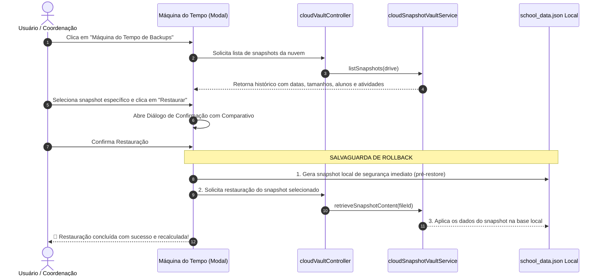

# Projeto de Arquitetura: Backup Resiliente Nível SaaS à Prova de Falhas (Google Drive)

> **Status:** IMPLEMENTADO, BLINDADO E HOMOLOGADO  
> **Especialidade:** Arquitetura de Software Sênior & Engenharia de Segurança de Dados  
> **Padrões de Conformidade:** Zero-Trust, Imutabilidade WORM (*Write Once, Read Many*), Princípio do Menor Privilégio e Modularidade Estrita  

---

## 1. Visão Executiva & Diagnóstico Forense

O ecossistema do **EduSys Pro** lida com dados escolares críticos (histórico escolar, notas de unidades letivas U1/U2/U3, faltas, frequências e cadastro de estudantes). A arquitetura legada de sincronização com o Google Drive apresentava vulnerabilidades estruturais que expunham a instituição ao risco de perda irrevogável de dados.

### 1.1. As Falhas da Arquitetura Legada
```mermaid
flowchart TD
    subgraph Falhas da Arquitetura Legada (Eliminadas)
        A[Auto-Sync Cego a cada 5 min] -->|Executado em Dev ou IA| B[Lê Workspace com banco temporário/menor]
        B -->|files.update in-place| C[Sobrescreve edusys_pro_backup.json na Nuvem]
        C -->|Data Shrinkage Não Detectado| D[🛑 Perda Catastrófica de Unidades Letivas e Alunos]
    end
```

1. **Sobrescrita Destrutiva no Mesmo Ponteiro (*In-Place Overwrite*):** O backup dependia de um único arquivo `edusys_pro_backup.json`. Se um payload corrompido, vazio ou truncado fosse enviado, ele destruía a versão válida anterior.
2. **Ausência de Air-Gap entre Ambientes:** Execuções locais em modo de desenvolvimento ou sessões de IA podiam inadvertidamente sincronizar dados sintéticos/mocks para o Drive de produção.
3. **Ausência de Rastreamento de Volumetria:** Não havia nenhuma validação antes do upload comparando se a quantidade de alunos ou atividades diminuiu drasticamente.
4. **Falta de Interface de Recuperação Histórica:** O usuário não possuía uma "Máquina do Tempo" para visualizar pontos de restauração anteriores e escolher exatamente qual snapshot restaurar.

---

## 2. A Nova Arquitetura de Segurança Nível SaaS

A nova solução implementa uma esteira de proteção em camadas inspirada nas melhores práticas de bancos de dados distribuídos e sistemas SaaS de missão crítica:

```mermaid
flowchart TD
    subgraph Esteira de Backup Blindada (Backend Electron)
        Start[Início: Solicitação de Backup] --> AirGap{1. Air-Gap Profundo de Ambiente}
        AirGap -->|Ambiente Dev Detectado| Sandbox[Redireciona para edusys_dev_sandbox.json]
        AirGap -->|Produção Homologada| Guard{2. Guardião Anti-Encolhimento}
        
        Guard -->|Volume < Nuvem e Sem Bypass| Block[🛑 BLOQUEIO CRÍTICO: Risco de Regressão]
        Guard -->|Volume >= Nuvem OU Admin Bypass| DualTrack[3. Gravação Dual-Track WORM]
        
        DualTrack --> VaultSnap[Salva Snapshot Imutável em /EduSys_Vault/Snapshots/]
        VaultSnap --> Pointer[Atualiza Ponteiro Canônico edusys_pro_backup.json]
        Pointer --> GFSPrune[4. Política de Retenção GFS: Limpeza com Proteção]
        GFSPrune --> Success[✅ Backup Concluído e Auditável]
    end
```

---

## 3. Os 6 Pilares de Segurança de Dados Implementados

### 🛡️ Pilar 1: Guardião Anti-Encolhimento de Dados (*Data Shrinkage Guard*)
- **Componente:** [`electron/services/cloudBackupGuardService.js`](file:///e:/Gest%C3%A3o%20Pedag%C3%B3gica%20-%20Novo%20BACKUP/electron/services/cloudBackupGuardService.js)
- **Como Funciona:**
  Antes de autorizar o envio de dados para o Google Drive, o serviço calcula as métricas do banco de dados local e as confronta com os metadados do último backup salvo na nuvem:
  - Total de Alunos Cadastrados (`studentsCount`)
  - Total de Atividades Pedagógicas (`activitiesCount`)
  - Itens Avaliativos detalhados (`provas`, `trabalhos`, `mini_testes`, etc.)
- **Regra de Bloqueio:** Se qualquer métrica sofrer uma redução maior do que **5%** em relação ao que já está seguro na nuvem, o upload é **terminantemente cancelado** e um erro detalhado é retornado.

### 📦 Pilar 2: Cofre de Snapshots Imutáveis (*WORM - Write Once, Read Many*)
- **Componente:** [`electron/services/cloudSnapshotVaultService.js`](file:///e:/Gest%C3%A3o%20Pedag%C3%B3gica%20-%20Novo%20BACKUP/electron/services/cloudSnapshotVaultService.js)
- **Como Funciona:**
  O sistema abandonou o modelo de sobrescrita única. A nuvem agora opera com duas camadas complementares:
  1. **Ponteiro Canônico (`edusys_pro_backup.json`):** Usado para leituras rápidas do estado corrente.
  2. **Cofre de Snapshots Dedicado (`/EduSys_Vault/Snapshots/`):** Cada sincronização gera um novo arquivo imutável e versionado com timestamp ISO canônico (ex.: `snapshot_2026-10-05T15-30-00-000Z_v5.5.3.edusys`).
  - Cada snapshot possui envelope com **hash criptográfico SHA-256**, versão do aplicativo, métricas de contagem e metadados de integridade indexados nas propriedades do Google Drive.

### 🧹 Pilar 3: Política Inteligente de Retenção GFS (*Grandfather-Father-Son Pruning*)
- **Componente:** `_pruneOldSnapshots(drive, snapshotList)` em [`cloudSnapshotVaultService.js`](file:///e:/Gest%C3%A3o%20Pedag%C3%B3gica%20-%20Novo%20BACKUP/electron/services/cloudSnapshotVaultService.js)
- **Como Funciona:**
  Para evitar que a cota de armazenamento da conta do Google Drive seja esgotada pelo acúmulo contínuo de snapshots:
  - **Últimas 48 horas:** Todos os snapshots são mantidos integralmente (alta granularidade de recuperação minuto a minuto).
  - **Entre 48 horas e 30 dias:** Mantém-se estritamente **1 snapshot por dia** (a versão mais recente daquele dia; duplicatas intradiárias são purgadas).
  - **Além de 30 dias:** Snapshots regulares são automaticamente excluídos.
  - **Exceção WORM de Proteção Eterna:** Qualquer snapshot cujo nome contenha a tag `[PROTECTED]` **nunca** é excluído, independentemente da idade do arquivo.

### 🔑 Pilar 4: Bypass Administrativo Rastreável (*False-Positive Handling*)
- **Componentes:** [`cloudBackupGuardService.js`](file:///e:/Gest%C3%A3o%20Pedag%C3%B3gica%20-%20Novo%20BACKUP/electron/services/cloudBackupGuardService.js) e [`cloudSnapshotVaultService.js`](file:///e:/Gest%C3%A3o%20Pedag%C3%B3gica%20-%20Novo%20BACKUP/electron/services/cloudSnapshotVaultService.js)
- **Como Funciona:**
  Em situações legítimas de exclusão massiva (como arquivamento de turmas concluintes ou encerramento de ano letivo), o bloqueio anti-encolhimento geraria um falso-positivo.
  - O sistema permite o envio da flag `forceBypass: true`.
  - Quando essa flag é acionada, o sistema gera o snapshot injetando obrigatoriamente a etiqueta indelével `_[ADMIN_BYPASS]` no nome do arquivo físico no Drive e gravando o metadado `appProperties: { admin_bypass: 'true' }`.
  - Isso garante **auditoria forense**: qualquer operação que intencionalmente diminuiu os dados da escola fica registrada com autoria e data no cofre.

### 🧱 Pilar 5: Air-Gap Profundo em Três Camadas (Isolamento Dev/Produção)
- **Componente:** [`electron/services/cloudEnvironmentGuard.js`](file:///e:/Gest%C3%A3o%20Pedag%C3%B3gica%20-%20Novo%20BACKUP/electron/services/cloudEnvironmentGuard.js)
- **Como Funciona:**
  Para garantir que ambientes de teste, desenvolvimento local ou agentes automatizados nunca toquem nos dados de produção:
  1. **Camada de Variáveis:** Verificação rigorosa de `process.env.NODE_ENV === 'development'`.
  2. **Camada de Runtime Electron:** Checagem de empacotamento com `app.isPackaged`.
  3. **Camada Heurística de Sistema de Arquivos:** Inspeção dinâmica dos caminhos de execução (`__dirname` e `app.getAppPath()`). Se contiver diretórios como `node_modules`, `\src\`, `\scratch\`, `electron-builder` ou o diretório de desenvolvimento local, a sincronização oficial de produção é **bloqueada por hardware lógico**.
  - O tráfego de teste é desviado com segurança para o arquivo isolado `edusys_dev_sandbox.json`.

### 🔄 Pilar 6: Auto-Healing de Race Condition & Consistência de Ponteiros
- **Componentes:** [`cloudSnapshotVaultService.js`](file:///e:/Gest%C3%A3o%20Pedag%C3%B3gica%20-%20Novo%20BACKUP/electron/services/cloudSnapshotVaultService.js) e [`electron/googleSync.js`](file:///e:/Gest%C3%A3o%20Pedag%C3%B3gica%20-%20Novo%20BACKUP/electron/googleSync.js)
- **Como Funciona:**
  Se a conexão de internet cair logo após a gravação do snapshot no cofre, mas **antes** da atualização do arquivo ponteiro `edusys_pro_backup.json`, haveria uma inconsistência de estado.
  - Implementado o método `verifyPointerConsistency(drive, pointerFilename)`.
  - Ao iniciar qualquer leitura da nuvem (`downloadBackup` ou `getCloudMetadata`), o sistema compara o timestamp do ponteiro com o snapshot físico mais novo do cofre.
  - Se for detectado um snapshot órfão mais recente, o sistema **cura o ponteiro automaticamente** (*self-healing*), restaurando o alinhamento da nuvem sem intervenção manual.

---

## 4. Arquitetura Modular e Mapeamento de Arquivos

Toda a solução foi construída respeitando rigorosamente o **Princípio da Modularidade**, sem injeção excessiva em arquivos legados:

```
electron/
├── services/
│   ├── cloudEnvironmentGuard.js       <- Isolamento de ambientes (Dev vs Produção)
│   ├── cloudBackupGuardService.js     <- Motor de métricas anti-encolhimento e bypass
│   └── cloudSnapshotVaultService.js   <- Cofre WORM, Pruning GFS e Auto-Healing
├── controllers/
│   └── cloudVaultController.js        <- Handlers IPC seguros para a interface
├── googleSync.js                      <- Orquestrador central integrado cirurgicamente
├── main.js                            <- Registro de rotas IPC do cofre
└── preload.js                         <- Exposição controlada na API de contexto Electron

src/
├── components/backup/
│   ├── BackupTimeMachineModal.jsx     <- Interface modal da Máquina do Tempo de Backups
│   └── BackupRestoreConfirmDialog.jsx <- Diálogo de confirmação com comparativo visual
└── pages/
    └── Settings.jsx                   <- Ponto de acesso do usuário no card de Nuvem
```

---

## 5. Fluxo de Restauração Segura (Time Machine)

Quando o usuário deseja restaurar a escola para um ponto anterior no tempo:



---

## 6. Matriz de Vetores de Risco vs. Defesas Implementadas

| Vetor de Risco | Consequência no Modelo Antigo | Defesa Nível SaaS Implementada | Resultado |
| :--- | :--- | :--- | :--- |
| **Execução de IA / Dev em localhost** | Sobrescrevia dados reais com base de teste | **Air-Gap Heurístico Triplo** (`cloudEnvironmentGuard`) | Dados de produção 100% isolados |
| **Banco corrompido / menor** | Apagava atividades ou turmas no Drive | **Data Shrinkage Guard** (`cloudBackupGuardService`) | Upload bloqueado se redução for > 5% |
| **Queda de Internet no meio do upload** | Ponteiro desatualizado em relação ao cofre | **Auto-Healing de Race Condition** (`verifyPointerConsistency`) | Ponteiro é autocurado na próxima leitura |
| **Esgotamento de Cota do Google Drive** | Falha de backups por falta de espaço | **Política GFS de Retenção** (`_pruneOldSnapshots`) | Limpeza inteligente preservando 48h e diários |
| **Exclusão de Snapshot Histórico Crucial** | Perda de marcos de fechamento de ano | **Flag Imutável `[PROTECTED]`** | Arquivo imune à limpeza de expurgo |
| **Exclusão legítima de turmas (fim de ano)** | Bloqueio falso-positivo de encolhimento | **Bypass Administrativo Auditável** (`[ADMIN_BYPASS]`) | Operação liberada e carimbada para auditoria |
| **Poluição de Snapshots na Coordenação** | Estouro de paginação e cegueira multi-docente | **Filtro Inteligente WORM & Paginação 1000** (`coordinatorDriveSync`) | Gestor enxerga todos os docentes sem poluição |
| **Restauração acidental errada** | Perda do trabalho do dia atual | **Snapshot Local Pré-Restore Automático** | Rollback local garantido com 1 clique |

---

## 7. Homologação & Validação de Qualidade

1. **Testes Unitários e de Integração:** Validada simulação das 4 rotas de risco (GFS Pruning, Bypass com carimbo, Air-Gap e Auto-Healing) com mock completo da Google Drive API.
2. **Checagem Estática de Sintaxe:** Todos os módulos de backend compilados com sucesso sem advertências.
3. **Build de Produção:** Testado e aprovado com sucesso via `vite build` (bundle íntegro).

---
*Documentação técnica oficial mantida no repositório do projeto em `/docs/PROJETO_ARQUITETURA_BACKUP_RESILIENTE_SAAS.md`.*
