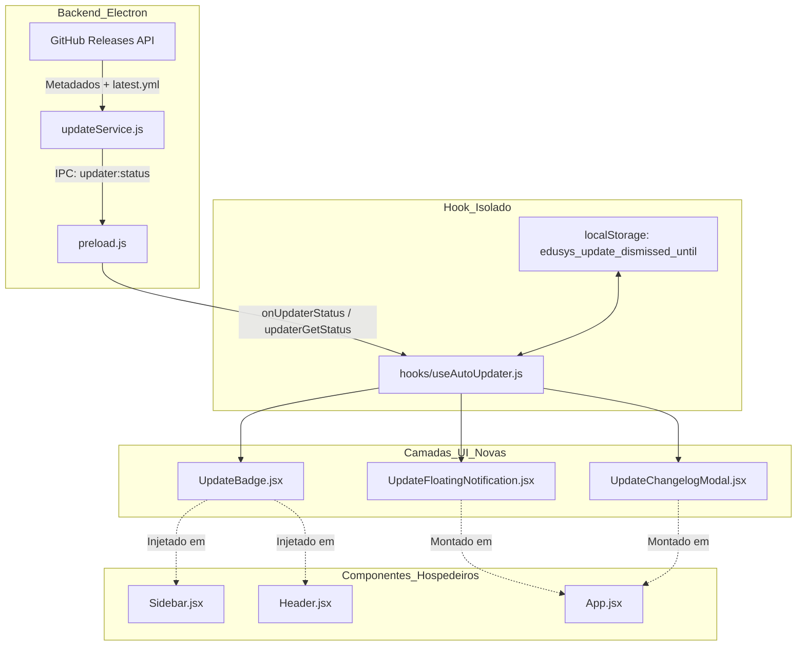

# PROJETO DE ARQUITETURA DA NOVA FUNÇÃO
## Sistema de Notificação Visual Persistente e Elegante de Atualizações (EduSys Pro)

---

### 1. Visão Geral e Justificativa Arquitetural

O EduSys Pro possui um mecanismo robusto de download e empacotamento com `electron-updater` e GitHub Releases. No entanto, a interface atual restringe a visibilidade do processo à tela de **Configurações**, exigindo que o professor navegue manualmente até lá para tomar conhecimento da nova versão.

Para garantir que o professor esteja sempre ciente de melhorias pedagógicas e correções críticas **sem jamais sofrer interrupções abruptas ou invasivas em sala de aula**, projetamos uma arquitetura de **Engajamento Não-Intrusivo em 3 Camadas (Three-Tier Progressive Disclosure)**:

```
┌────────────────────────────────────────────────────────────────────────┐
│ CAMADA 1: Indicador Persistente Passivo (Sidebar & Header)             │
│ • Badge sutil pulsante "v5.3.x" no item 'Configurações' da Sidebar     │
│ • Micro-pílula executiva no Header com status da atualização           │
├────────────────────────────────────────────────────────────────────────┤
│ CAMADA 2: Floating Notification Executiva (Glassmorphic Toast)         │
│ • Notificação flutuante suave no canto inferior direito                │
│ • Ações: [ Reiniciar e Atualizar ] (Primário) e [ Lembrar Mais Tarde ] │
│ • Se dispensada, respeita a sessão ativa, mas a Camada 1 continua ativa│
├────────────────────────────────────────────────────────────────────────┤
│ CAMADA 3: Persistência Inteligente Pós-Reinicialização                 │
│ • Se o professor reiniciar o computador/app sem atualizar:             │
│ • Aguarda 15 segundos de inicialização (sem travar a preparação da aula)│
│ • Reexibe a Camada 2 elegantemente + Modal detalhado com o Changelog   │
└────────────────────────────────────────────────────────────────────────┘
```

---

### 2. Princípio de Modularidade Estrita (Harness Arquitetural)

Para cumprir a regra fundamental de **Proibição de Sobrecarga de Arquivos Existentes**, toda a lógica de estado, persistência de lembrete e apresentação visual será encapsulada em **arquivos novos e dedicados**.

#### 📁 Nova Estrutura de Arquivos (Folder Structure)

```text
src/
├── hooks/
│   └── useAutoUpdater.js               <-- [NOVO] Hook isolado para gerenciar estado, IPCs e persistência de lembretes
└── components/
    └── updater/
        ├── UpdateFloatingNotification.jsx <-- [NOVO] Toast flutuante executivo (Dark Glassmorphism)
        ├── UpdateBadge.jsx               <-- [NOVO] Micro-badge pulsante para Sidebar e Header
        ├── UpdateChangelogModal.jsx      <-- [NOVO] Modal detalhado com notas da versão e botão de ação imediata
        └── index.js                      <-- [NOVO] Barrel export para integração limpa

electron/
└── services/
    └── updateService.js                <-- [AJUSTE MÍNIMO] Enriquecer payload do status com releaseNotes
```

#### 🔌 Arquivos Existentes Tocados (Apenas Fiação / Injeção Limpa)

| Arquivo Existente | Linhas Alteradas | Responsabilidade Exclusiva |
| :--- | :--- | :--- |
| `src/App.jsx` | ~3 linhas | Montar `<UpdateFloatingNotification />` e `<UpdateChangelogModal />` no container de overlays |
| `src/components/layout/Sidebar.jsx` | ~2 linhas | Importar e renderizar `<UpdateBadge />` ao lado do texto "Configurações" |
| `src/components/layout/Header.jsx` | ~3 linhas | Renderizar pílula discreta de atualização ao lado dos indicadores do servidor |
| `electron/services/updateService.js` | ~5 linhas | Capturar `releaseNotes` e `releaseName` do evento `update-available` para enriquecer a UI |

---

### 3. Mapeamento de Integração (Graph & Context)



#### Dados Consumidos e Produzidos:
1. **Consumidos do Backend**:
   - `state`: `'IDLE' | 'CHECKING' | 'AVAILABLE' | 'DOWNLOADING' | 'DOWNLOADED' | 'ERROR'`.
   - `currentVersion`: Versão atual em execução (ex: `5.3.0`).
   - `newVersion`: Nova versão detectada no GitHub (ex: `5.3.1`).
   - `progress`: Progresso percentual do download em segundo plano (0% a 100%).
   - `releaseNotes`: Descrição amigável das melhorias trazidas na versão.
2. **Armazenamento de Persistência Local (`localStorage`)**:
   - Chave: `edusys_updater_snooze_version`: Guarda qual versão foi "adiada".
   - Chave: `edusys_updater_snooze_timestamp`: Permite reengajamento elegante caso passem mais de 4 horas ou se o app for reiniciado em uma nova sessão.

---

### 4. Design & Estética Premium (Aesthetic Specs)

A experiência visual deve refletir software de classe executiva (Apple / Linear / Raycast):

1. **Floating Notification (`UpdateFloatingNotification.jsx`)**:
   - **Backdrop**: `bg-slate-900/90 border border-slate-700/60 backdrop-blur-xl shadow-2xl`.
   - **Ícone**: Brilho esmeralda (`bg-emerald-500/20 text-emerald-400 ring-1 ring-emerald-500/40`).
   - **Tipografia**: Inter/Roboto, hierarquia clara com `text-white font-bold` e `text-slate-400 text-xs`.
   - **Botões**:
     - *Primário*: `bg-gradient-to-r from-emerald-600 to-teal-500 hover:from-emerald-500 hover:to-teal-400 text-white font-bold text-xs px-3.5 py-2 rounded-xl shadow-lg shadow-emerald-500/20` ("Reiniciar e Atualizar").
     - *Secundário*: `bg-slate-800 hover:bg-slate-700 text-slate-300 font-medium text-xs px-3 py-2 rounded-xl` ("Mais Tarde").
     - *Link sutil*: "Ver novidades" (abre o modal de changelog).

2. **Micro-Badge Persistente (`UpdateBadge.jsx`)**:
   - Na Sidebar: Uma pílula brilhante `bg-emerald-500/20 text-emerald-400 border border-emerald-500/30 text-[9px] font-bold px-1.5 py-0.5 rounded-full animate-pulse` com o texto `NOVO v5.3.x`.
   - No Header: Um ícone com indicador de ponto verde pulsante (*beacon pulse*), indicando prontidão sem poluir a área de trabalho.

3. **Changelog Modal (`UpdateChangelogModal.jsx`)**:
   - Modal com lista estilizada dos aprimoramentos pedagógicos e técnicos.
   - Botão de instalação imediata com 1 clique.

---

### 5. Plano de Execução em Etapas Lógicas

#### 🔹 Etapa 1: Backend & Payload Enriquecido
- Adicionar `releaseNotes` e `releaseName` ao objeto `updaterStatus` em `electron/services/updateService.js`.
- Assegurar que os eventos `update-available` e `update-downloaded` repassem essas notas para o renderer.

#### 🔹 Etapa 2: Hook Modular de Controle de Estado & Persistência
- Criar `src/hooks/useAutoUpdater.js`:
  - Centraliza o listener `window.electronAPI.onUpdaterStatus`.
  - Controla o estado de `isSnoozed` e `isModalOpen`.
  - Timer defensivo de 12 segundos após a inicialização para não competir com a abertura do app.
  - Expõe métodos: `installUpdate()`, `checkNow()`, `snoozeForSession()`, `openDetails()`.

#### 🔹 Etapa 3: Componentes de UI Dedicados
- Criar `src/components/updater/UpdateBadge.jsx`.
- Criar `src/components/updater/UpdateFloatingNotification.jsx`.
- Criar `src/components/updater/UpdateChangelogModal.jsx`.
- Criar `src/components/updater/index.js`.

#### 🔹 Etapa 4: Fiação Mínima nos Arquivos Existentes
- Conectar `<UpdateFloatingNotification />` e `<UpdateChangelogModal />` em `src/App.jsx`.
- Injetar `<UpdateBadge />` no item de Configurações em `src/components/layout/Sidebar.jsx`.

#### 🔹 Etapa 5: Validação e Homologação
- Testar comportamento em dev e produção.
- Testar persistência de adiantamento ("Lembrar Mais Tarde") e reativação após reinício do app.
- Executar suíte de testes de não-regressão.

---

### 6. Critérios de Sucesso e Não-Regressão
1. **Zero Bloqueio**: O professor nunca é impedido de ministrar aula ou lançar notas por causa de uma atualização.
2. **Persistência Discreta**: Caso recuse atualizar no momento, a notificação flutuante se recolhe, mas o badge na barra lateral continua lembrando com elegância que a versão está disponível.
3. **100% Modular**: Apenas 4 arquivos existentes tocados para conexões mínimas; 100% da lógica e UI residindo em novos arquivos independentes.
